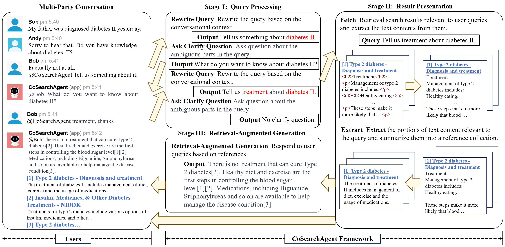
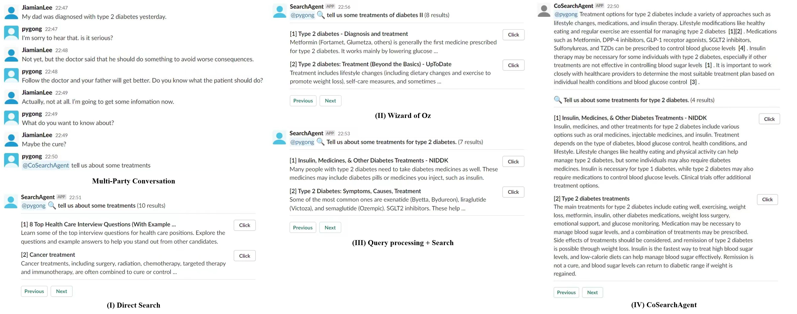

# CoSearchAgent: A Lightweight Collaborative Search Agent with Large Language Models

## Introduction
To better support the research in collaborative search, we propose **CoSearchAgent**, a lightweight collaborative search agent powered by LLMs. CoSearchAgent is designed as a Slack plugin that can support collaborative search during multi-party conversations on this platform. Equipped with the capacity to understand the queries and contexts in multi-user conversations and the ability to search the Web for relevant information via APIs, CoSearchAgent can respond to user queries with answers grounded on the relevant search results. It can also ask clarifying questions when the information needs are unclear. We implement this agent in both English and Chinese.



## Demo Video
<video width="610" height="400" controls>
  <source src="./demo.mp4" type="video/mp4">
</video>

## How to deploy
1. Register a Slack account, log in, and create a Workspace.
2. Link MySQL, create two tables respectively used to store user information and channel information.
3. Create a channel and insert channel information into the data table.
4. Insert your and the invited user's personal information into the data table.
5. Register your CoSearchAgent APP in the created workspace, obtain the APP Token, Bot Token and Bot Id, and write them into cosearch_agent_app.py.
6. Input your OpenAI API key, SerpAPI key and mysql password into utils.py
7. Execute the following code to run CoSearchAgent:
   ```python
    python [en/zh]_cosearch_agent_app.py
   ```
9. Introduce CoSearchAgent into the created channel and use @CoSearchAgent to initiate queries with starting tokens.
   
## Case Study
CoSearchAgent not only accurately rewrites the user query for search but also offers a detailed and precise answer, supported by citation markers. Moreover, displaying content relevant to the query in the search results makes it more convenient for users to assess whether to navigate to the corresponding search page for detailed reading, thereby improving search efficiency.



## Authors
- Peiyuan Gong
- Jiamian Li
- Jiaxin Mao (corresponding author)

Please contact us at pygongnlp@gmail.com if you have any questions!

